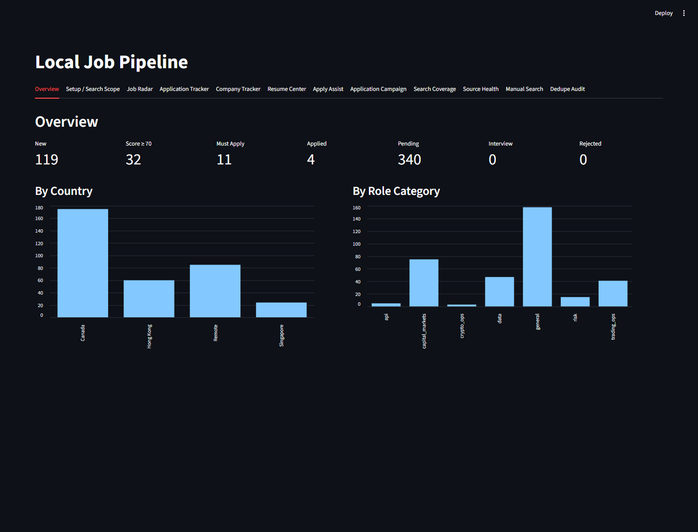

# Local Job Pipeline

[](https://github.com/Tcx086/local-job-pipeline/actions/workflows/ci.yml)

Local Job Pipeline is a local-first Python workflow for job search planning, public posting collection, scoring, reporting, dashboard review, resume-profile organization, and manual application campaign planning.

It is designed for any job seeker to configure on their own machine. Public examples use placeholder data only.



Dashboard preview: review scored jobs, inspect search scope, track applications, and plan a daily manual application campaign.

## Why This Exists

Job searching creates a lot of scattered local state: searches, duplicate postings, fit notes, reports, resume drafts, and application follow-ups. This project keeps that workflow local and review-first, so a user can prioritize real opportunities without auto-submitting applications or storing sensitive application answers in a public repository.

## What It Does

- Builds a configurable search plan from `config/search_scope.yaml`.
- Collects public job postings through supported job boards and public ATS endpoints.
- Scores jobs with transparent keyword and fit heuristics.
- Writes local CSV/JSON/SQLite/report outputs under `data/`.
- Provides a Streamlit dashboard for review, tracking, and manual application support.
- Helps plan a daily application queue without submitting applications.
- Can generate local resume drafts from user-provided resume YAML profiles.

## What It Does Not Do

- It does not auto-apply, auto-submit, or click final application buttons.
- It does not automate logins, bypass captchas, bypass Cloudflare, evade rate limits, or use proxies.
- It does not scrape private data or access non-public application systems.
- It does not create real resume facts for you.
- It does not store sensitive identity data unless you add it yourself, which you should not do.

## Compliance And Safety

Use this tool only for public job search, local scoring, local reporting, and manual application assistance. Review every generated answer, resume, and report before using it. Do not store government ID numbers, exact birth dates, financial account data, medical data, demographic answers, or other sensitive application answers in this repository.

## Installation

Windows PowerShell:

```powershell
git clone https://github.com/Tcx086/local-job-pipeline.git
cd local-job-pipeline
python -m venv .venv
.\.venv\Scripts\Activate.ps1
python -m pip install --upgrade pip
python -m pip install -r requirements.txt
```

macOS/Linux:

```bash
git clone https://github.com/Tcx086/local-job-pipeline.git
cd local-job-pipeline
python3 -m venv .venv
source .venv/bin/activate
python -m pip install --upgrade pip
python -m pip install -r requirements.txt
```

## Quickstart

```powershell
git clone https://github.com/Tcx086/local-job-pipeline.git
cd local-job-pipeline
python -m venv .venv
.\.venv\Scripts\Activate.ps1
python -m pip install --upgrade pip
python -m pip install -r requirements.txt
python -m job_pipeline.setup_wizard --init
python -m job_pipeline.scheduler --run-once --sample
python -m job_pipeline.campaign --today --dry-run
streamlit run job_pipeline/dashboard.py
```

## Edit Search Scope Manually

Copy or create `config/search_scope.yaml`. Start from `config/search_scope.example.yaml`, then edit:

- `search.sites` for job boards.
- `countries.<name>.enabled` to turn a country on or off.
- `locations` for city, region, or remote searches.
- `search_terms` for role keywords.
- `filters.min_score`, `include_keywords`, and `exclude_keywords` for review preferences.

At least one country must be enabled, each enabled country needs one location and one role keyword, and supported site names are `linkedin`, `indeed`, `google`, `glassdoor`, and `zip_recruiter`.

## Run A Real Search

After reviewing your local config:

```powershell
python -m job_pipeline.scheduler --run-once --mode normal
```

Preview the search plan without external requests:

```powershell
python -m job_pipeline.scheduler --run-once --dry-run-plan
```

## Reports

Scheduler runs write raw data, scored rows, search coverage, source health, and report files under `data/`. The dashboard reads the local SQLite database and generated reports.

## Application Campaign Mode

Campaign mode builds a local queue from jobs already in SQLite:

```powershell
python -m job_pipeline.campaign --today --dry-run
python -m job_pipeline.campaign --today
```

Use it as a planning checklist. Open applications yourself, review every answer yourself, and submit manually.

## Resume Profiles

Public resume examples live in `templates/master_resume.example.yaml` and `templates/resume_profiles/*.example.yaml`. Copy them to local ignored files, replace placeholders with your real experience, and never let the generator invent employers, dates, degrees, or achievements.

Recommended local files:

```text
templates/master_resume.yaml
templates/resume_profiles/general_data.local.yaml
config/resume_profile_paths.local.yaml
```

## Privacy Warning

Local outputs under `data/` can contain job history, notes, generated reports, generated resumes, and application tracking data. They are ignored by Git by default. Review the repository manually before publishing a fork or release.

## Troubleshooting

- Missing config: run `python -m job_pipeline.setup_wizard --init`.
- Invalid site name: use one of `linkedin`, `indeed`, `google`, `glassdoor`, `zip_recruiter`.
- JobSpy import error: run `python -m pip install -r requirements.txt` inside your virtual environment.
- Empty dashboard: run `python -m job_pipeline.scheduler --run-once --sample` first.
- DOCX/PDF generation issues: install LibreOffice for PDF conversion, or use the generated Markdown output.

## Developer Test Commands

```powershell
python -B -m pytest
python -B -m job_pipeline.setup_wizard --dry-run
python -B -m job_pipeline.scheduler --run-once --sample
python -B -m job_pipeline.campaign --today --dry-run
rg -n "YOUR_REAL_NAME|LOCAL_ABSOLUTE_PATH|API_KEY|SECRET|PRIVATE_RESUME|SQLITE|generated resume|generated report" .
```

Run a human privacy review before publishing.
